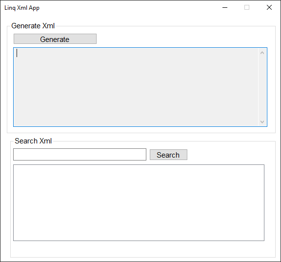
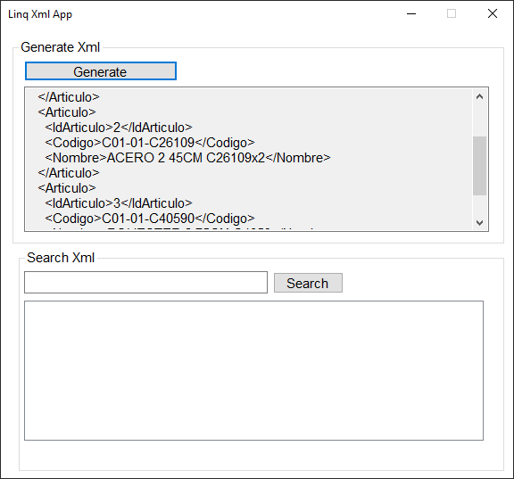
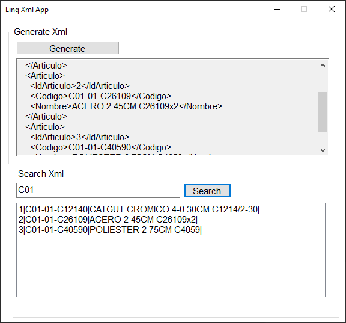

# Trabajando LINQ para XML 

XML se ha convertido en un excelente estándar abierto para el intercambio de información entre aplicaciones de software debido a la manera de representar información estructurada, independiente de la plataforma, lenguaje de programación o sistema operativo, es utilizado extensamente en archivos y protocolos de Internet por ser un formato fácil de leer y suficientemente flexible para adaptarse a muchos propósitos. 

Debido a estas características XML y sus tecnologías están completamente integradas y soportadas por la plataforma .NET mediante un conjunto de clases que proporcionan lectura y escritura de documentos, validación, navegación, serialización, transformación y búsquedas. Aunque estas clases son suficientes para trabajar con XML su utilización no es sencilla y puede producir código difícil de mantener, por lo que .NET incorpora LINQ para XML (LINQ to XML) como una mejor manera de trabajar con XML.

Para mostrar de una manera práctica la utilización de LINQ para XML, ejecutamos el siguiente programa en donde muestra como realizar la consulta del archivo XML donde el valor contenga el texto escrito dentro de txtQuery, es aquí donde en esencia se utilizan las expresiones de consulta de LINQ una vez que se carga el documento XML en memoria. 

